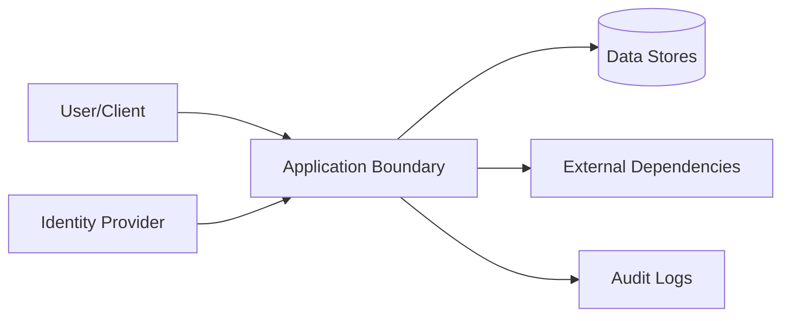

# Security

## Threat Model

## STRIDE Table
| Threat | Surface | Mitigation | Verification |
|---|---|---|---|
| Spoofing | Auth boundary | strong auth + token validation | auth tests |
| Tampering | State mutation APIs | integrity checks + RBAC | integration tests |
| Repudiation | Critical actions | immutable audit logs | log review |
| Information disclosure | Data at rest/in transit | encryption + classification | security scans |
| Denial of service | Hot paths | rate limit + backpressure | load tests |
| Elevation of privilege | Admin interfaces | least privilege + policy checks | authz tests |

## Authentication
- Identity source:
- Token/session lifetime:
- Rotation and revocation:

## Authorization
- Role model:
- Resource-level policy:
- Privilege escalation controls:

## Data Classification
| Data Class | Examples | Storage Rules | Access Rules |
|---|---|---|---|
| Public | docs, non-sensitive metadata | standard | unrestricted |
| Internal | operational telemetry | controlled | team access |
| Sensitive | tokens, PII, secrets | encrypted | least privilege |

## Sensitive Data Handling
- Encryption at rest:
- Encryption in transit:
- Redaction in logs:
- Retention + deletion policy:

## Supply Chain Security
- Recommended scanners: `npm audit`, `osv-scanner`, `snyk`
- Dependency update cadence:
- Signed artifact/provenance strategy:

## Secrets Management
| Secret | Source | Rotation | Consumer |
|---|---|---|---|
| API credentials | secret manager/env | periodic | runtime services |
| Signing keys | HSM/KMS/local secure store | periodic | release pipeline |

## Security Testing
| Test Type | Cadence | Tooling |
|---|---|---|
| SAST | each PR | language linters/scanners |
| Dependency scan | each PR + weekly | supply-chain tools |
| DAST/pentest | scheduled | external/internal |

## Compliance and Audit
- Regulatory scope:
- Audit evidence location:
- Exception process:

## Pre-Promotion Security Checklist
- [ ] Threat model updated for changed surfaces.
- [ ] Auth/authz tests pass.
- [ ] Dependency vulnerability scan reviewed.
- [ ] No unresolved critical/high security findings.
