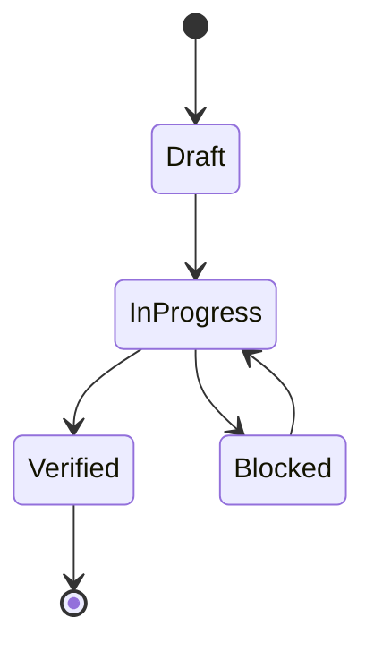

# Semantics

## State Machines

| From | Event | To | Guard | Side Effect |
|---|---|---|---|---|
| Draft | start | InProgress | owner assigned | emit state change |
| InProgress | validate_pass | Verified | all blocking gates pass | persist receipt hash |
| InProgress | dependency_blocked | Blocked | external dependency unavailable | emit alert event |

## Invariants
| Invariant | Type | Validation |
|---|---|---|
| No promoted change without proof | System | validation gate |
| Canonical source-of-truth per entity | Data | interface/spec review |
| Mutation events are replayable | Data | deterministic replay |

## Event Sourcing Schema
| Field | Type | Description |
|---|---|---|
| event_id | string | globally unique event id |
| aggregate_id | string | entity/workflow id |
| event_type | string | semantic transition |
| payload | object | transition data |
| recorded_at | timestamp | append time |

## Replay Semantics
- Replay order:
- Conflict resolution:
- Snapshot cadence:
- Determinism proof strategy:

## Error Code Semantics
- Namespace:
- Stable compatibility window:
- Mapping to retry/degrade behavior:

## Domain Rules
- Business rule 1:
- Business rule 2:
- Business rule 3:

## Idempotency Contracts
| Operation | Idempotency Key | Duplicate Behavior |
|---|---|---|
| create/update mutation | request_id | return original result |
| async enqueue | event_id | ignore duplicate enqueue |

## Language Note
- Primary language inferred: typescript/javascript
