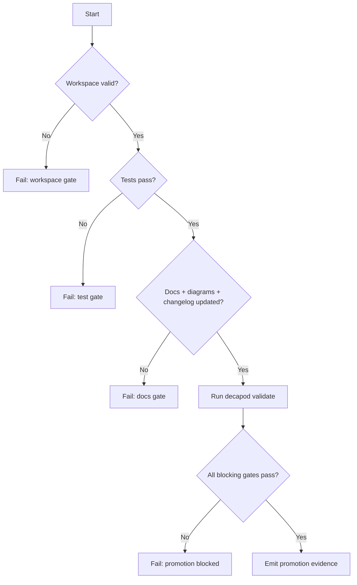
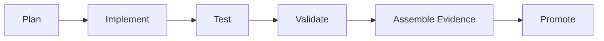

# Validation

## Validation Philosophy
> Validation is a release gate, not documentation theater.

## Validation Decision Tree

## Promotion Flow

## Proof Surfaces
- `decapod validate`
- Required test commands:
- `npm test`
- Required integration/e2e commands:

## Promotion Gates

## Blocking Gates
| Gate | Command | Evidence |
|---|---|---|
| Architecture + interface drift check | `decapod validate` | Gate output |
| Tests pass | project test command | CI + local logs |
| Docs + changelog current | repo docs checks | PR diff |
| Security critical checks pass | security scanner suite | scanner reports |

## Warning Gates
| Gate | Trigger | Follow-up SLA |
|---|---|---|
| Coverage regression warning | Coverage drops below target | 48h |
| Non-blocking perf drift | P95 regression below hard threshold | 72h |

## Evidence Artifacts
| Artifact | Path | Required For |
|---|---|---|
| Validation report | `.decapod/generated/artifacts/provenance/*` | Promotion |
| Test logs | CI artifact store | Promotion |
| Architecture diagram snapshot | `ARCHITECTURE.md` | Promotion |
| Changelog entry | `CHANGELOG.md` | Promotion |

## Regression Guardrails
- Baseline references:
- Statistical thresholds (if non-deterministic):
- Rollback criteria:

## Bounded Execution
| Operation | Timeout | Failure Mode |
|---|---|---|
| Validation | 30s | timeout or lock |
| Unit test suite | project-defined | non-zero exit |
| Integration suite | project-defined | non-zero exit |

## Coverage Checklist
- [ ] Unit tests cover critical branches.
- [ ] Integration tests cover key user flows.
- [ ] Failure-path tests cover retries/timeouts.
- [ ] Docs/diagram/changelog updates included.
